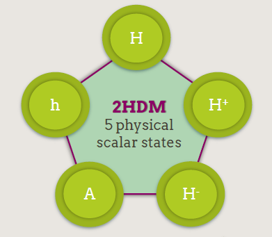
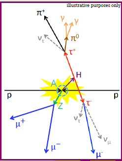
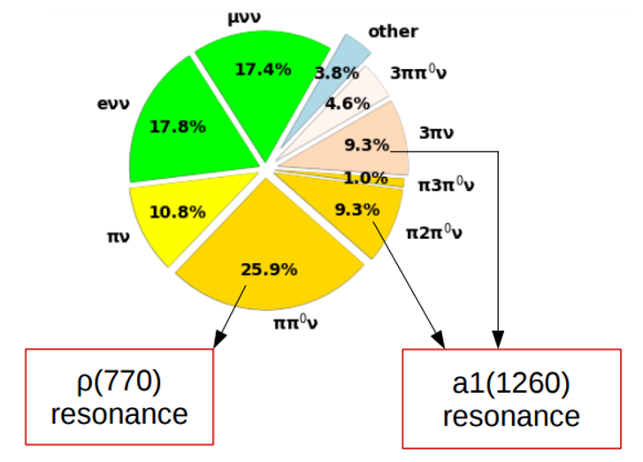
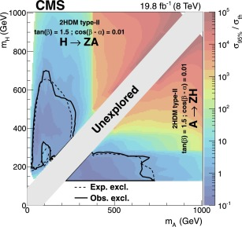

# HZA_CMSDASLPC23
Long exercise for a search of two neutral Higgs bosons through the H -> Z A -> llττ  process

## Reccomended short exercise

## Introduction

The H -> Z A -> llττ search is a beyond SM analysis aiming to investigate the existance of two new resonances in the extended Higgs sector.

This scenario is mainly inspired by models with two Higgs doublets (2HDM) [1](https://arxiv.org/pdf/1106.0034.pdf). In a 2HDM model two doublets of Higgs fields are present, as opposed to the single one of the SM, giving rise to two neutral CP-even scalars (h, H), one neutral CP-odd pseudo-scalar (A), and two charged scalars (H+, H-).

  

The light h scalar is generally identified with the 125 GeV scalar resonance discovered in 2012 and in order to be consistent with the SM-like properties of the latter, one must consider a limited part of the parameter space (the so-called “alignment limit”). The 2HDM models are attractive because they allow generation of the observed asymmetry in the Universe between matter and anti-matter. Another important motivation is Supersymmetry, which belongs to the broad class of 2HDMs.

Supersymmetric models can provide an elegant solution to the naturalness issue. Supersymmetry is also attractive because it generally includes a candidate for particle dark matter and can possibly lay down the bases for the unification of forces. Axion models, which would explain how the strong interaction does not violate the CP symmetry, would also give rise to an effective low-energy theory with two Higgs doublets. Finally, it has also been noted that certain realizations of 2HDMs can accommodate the muon g-2 anomaly without violating the present theoretical and experimental constraints.
According to Ref [2](https://arxiv.org/pdf/1405.5537.pdf), the pseudo-scalar boson A would decay into HZ with the highest branching ratio. For this reason, A→ZH appears as the most promising exotic decay channel and, in addition, H→ττ would represent a clean final state. 

The challenge of this analysis is that we don't know the masses of the A and the H, thus we have to explore several mass scenarios. 

For this exercise we will have 6 different mass combination.

Last thing to be mentioned is that this search has not yet been investigated with Run-2 data, you will have the chance to enchallenge yourself with 2018 real data!

Good luck!

## Setting up the analysis

For this analysis we are proposing a new python-based framework that will handle NanoAOD samples and will run the analysis with RooDataFrame.

The framework is called [Bamboo](https://bamboo-hep.readthedocs.io/en/latest/install.html#fresh-install) and here are the instructions to download it:

```
mkdir bamboodev
cd bamboodev
# make a virtualenv
source /cvmfs/sft.cern.ch/lcg/views/LCG_102/x86_64-centos7-gcc11-opt/setup.sh
python -m venv bamboovenv
source bamboovenv/bin/activate
# clone and install bamboo
git clone -o upstream https://gitlab.cern.ch/cp3-cms/bamboo.git
pip install ./bamboo
# clone and install plotIt
git clone -o upstream https://github.com/cp3-llbb/plotIt.git
mkdir build-plotit
cd build-plotit
cmake -DCMAKE_INSTALL_PREFIX=$VIRTUAL_ENV ../plotIt
make -j2 install
cd -
```

then do this:

```bash
pip install git+https://gitlab.cern.ch/cp3-cms/pyplotit.git
```

Each time that you open a new session:

```bash
source /cvmfs/sft.cern.ch/lcg/views/LCG_102/x86_64-centos7-gcc11-opt/setup.sh
source bamboodev/bamboovenv/bin/activate
source /cvmfs/cms.cern.ch/cmsset_default.sh
```

You'll need also a valide proxy:

```
voms-proxy-init -voms cms
export X509_USER_PROXY=~/.x509up_u`id -u`
```
Once bamboo is installed you can go in the folder `bamboodev/bamboo/examples` and clone this repository.

Before running on the samples in samples_2018UL_all.yml, you will need to change it slightly. Some samples refer to a file (Cert_314472-325175_13TeV_Legacy2018_Collisions18_JSON.txt) that is on the CERN AFS. We included this file in this repo, so you will need to change its address in the .yml file.
For example:
/afs/cern.ch/cms/CAF/CMSCOMM/COMM_DQM/certification/Collisions18/13TeV/Legacy_2018/Cert_314472-325175_13TeV_Legacy2018_Collisions18_JSON.txt
to
/uscms/home/[USER]/nobackup/bamboodev/bamboo/examples/HZAlltautau_bamboo/Cert_314472-325175_13TeV_Legacy2018_Collisions18_JSON.txt

## Quick reminder of object reconstruction

In this analysis we will deal with muons, electrons and taus:

- muons: they are very well reconstructed in the CMS detector thanks to the muon chambers (RPC, DT, CSC) and thanks to the fact that they leave a clear signature passing the full dector at MIP. Thanks to this their tracks are also clearly identified by the tracker.

- electrons: we reconstruct electrons mainly thanks to the traker and the electromagnetic calorimeter (ECAL). The resolution of the calorimeter, the segmentation of the tracker and the fact that electrons are always produced within jets, makes the reconstruction more complicated with respect to the muons one. By appling some offline tools we can anyway achieve a good performance.

- taus: those leptons decay very soon and we can only reconstruct them by looking at the products decay. They go mainly into hadrons (jets) but also into leptons + neutrinos. It goes without saying that the reconstruction of the taus is way more complicated with respect to muons and electrons, but they also provide a very clear signature. In particular we can identify those particles mainly with Machine Learing methods (as you will see soon).



Other few things to have in mind is that we want to identify the 4 leptons that are in our signal region (H -> Z A -> llττ) and we want to disentagle those 4 leptons from all the other processes that can generate such a signature.

## Signal and background samples

In this exercise we will use 6 different signal samples with mH = 600 GeV and mA = [100,150,200,250,300,350,400].

Samples were privately produced and are available here:

| Year | mass A | mass H | tan &beta; | Events |xs [pb] (from MG)| DAS name |
| :---: | :---: | :---: | :---: | :---: | :---: | :---: |
| 2018 | 100 GeV  | 600 GeV | 1.5 | 100k |0.02326 |/HToZATo2L2B_600p00_100p00_1p50_MassProd2/pmastrap-crab__HToZATo2L2B_600p00_100p00_1p50_ggH_nano-00000000000000000000000000000000/USER |
| 2018 | 150 GeV  | 600 GeV | 1.5 | 100k |0.02297 |/HToZATo2L2B_600p00_150p00_1p50_MassProd2/pmastrap-crab__HToZATo2L2B_600p00_150p00_1p50_ggH_nano-00000000000000000000000000000000/USER |
| 2018 | 200 GeV  | 600 GeV | 1.5 | 100k |0.02221 |/HToZATo2L2B_600p00_200p00_1p50_MassProd2/pmastrap-crab__HToZATo2L2B_600p00_200p00_1p50_ggH_nano-00000000000000000000000000000000/USER|
| 2018 | 250 GeV  | 600 GeV | 1.5 | 100k |0.02137 |/HToZATo2L2B_600p00_250p00_1p50_MassProd2/pmastrap-crab__HToZATo2L2B_600p00_250p00_1p50_ggH_nano-00000000000000000000000000000000/USER|
| 2018 | 300 GeV  | 600 GeV | 1.5 | 100k |0.0198 |/HToZATo2L2B_600p00_300p00_1p50_MassProd2/pmastrap-crab__HToZATo2L2B_600p00_300p00_1p50_ggH_nano-00000000000000000000000000000000/USER |
| 2018 | 350 GeV  | 600 GeV | 1.5 | 100k |0.01756 |/HToZATo2L2B_600p00_350p00_1p50_MassProd2/pmastrap-crab__HToZATo2L2B_600p00_350p00_1p50_ggH_nano-00000000000000000000000000000000/USER |
| 2018 | 400 GeV  | 600 GeV | 1.5 | 100k |0.01356 |/HToZATo2L2B_600p00_400p00_1p50_MassProd2/pmastrap-crab__HToZATo2L2B_600p00_400p00_1p50_ggH_nano-00000000000000000000000000000000/USER|

The background samples were centrally produced by CMS.

The main processes contributing to the llττ final state are:

- Drell-Yan (pp -> Z\γ* -> ll, l=e,m,τ): it has a large cross section and two leptons peaking at the Z mass.

- di-vector boson production and three-vector boson production VV, VVV (V = Z,W): were we have leptons and jets that can be easly misidentify as taus

- ZH (Z -> ll, H -> ττ): this is the SM production of Z and H that has exactly the same final state of the signal (irreducible background), the only difference is that the ττ system peaks at 125 GeV and not at our signal mass value

- Single Higgs into 4l (H -> ZZ -> 4l): this has 4 leptons in the final state

- top processes (ttW, ttZ, ttjets and single top production): those processes can easly have leptons in the final state

Those signal and background processes are specified in the `sample_2018UL_all.yml` file that you will have to use

## Event selection

The final state that we are investigating has 4 leptons: 2 muons coming from the Z decay and 2 taus coming from the A decay.

The first step of the analysis is the reconstruction of the Z into μμ, in order to do so you have to selected:

- 2 good muons whose peak aorund 91 GeV

After the Z selection, we have to select the taus coming from the A, depending on the tau decay and selecting the three most sensitive categories we can divide the events into:

- 1μ1τ region
- 1ele1τ region
- 2τ region

You have to implement both of this selections in the analysis macro `ZATolltautau.py`.

After having those 3 regions we want to make sure that our signal is well reconstructed. We can do this by tightening or loosening cuts on the objects, in particular we are asking you to choose the best cut on the identification of the object (you can play with tau, electron and muon IDs). The best choice is the one that has the highest $S / \sqrt{B}$ value.

To run the macro you have to do this:

```
bambooRun -m  ZAtolltautau.py:ZhToLLTauTau samples_2018UL_try.yml --envConfig=../cern.ini -o test --maxFiles=1
```

Have fun!

## Fake rate estimation

NB if you are in this group please pray

The reducible background (Z + X) originates from processes that contain one or more non-prompt leptons and are not simulated in the montecarlo. Thus we have to find a way to estimate the ZX contribution.

The main sources of non-prompt leptons are non-isolated electrons and muons coming from decays of heavy-flavour mesons, mis-reconstructed jets (usually originating from light-flavour quarks) and electrons from γ conversions. 

In this section we will consider a fake muon (or tau) any jet mis-reconstructed as a lepton and any lepton originating from a heavy meson decay. Similarly, any electron originating from a photon conversion will be considered a fake electron.

The rate of these background processes is estimated by measuring the $f_e$, $f_μ$ and $f_τ$ probabilities for fake electrons, fake muons and fake taus which do pass the loose selection criteria to also pass the final selection criteria (defined in the section above). These probabilities, referred to as fake rates, are applied in dedicated control samples in order to extract the expected background yield in the signal region.

In few words you have to select events with a good Z + loose lepton where we are assuming that the loose lepton is a mis-identify (fake) lepton. You have to calculate the probability that the loose lepton passes the tight id criteria, so basically the probability that a bad object can fall in your signal region (don't worry it's just a ratio : N_events_tight_lepton/N_events_loose_lepton). 

This procedure has to be done on data and you have to remember that you have to subtract from data the mc that has a Z + a real lepton (I'm talking about the WZ process in which you have one Z and one lepton coming from the W decay).

To help you, we prepared for you 3 parquet files (here `/eos/uscms/store/user/cmsdas/2023/long_exercises/HZA/Fake_Rate/`), one for each category, with a Z+l for data and VV processes.

You can play with `FR_muons.py`

Have fun!

## ZX estimation

If you are at this point it means that you have computed the $f_e$, $f_μ$ and $f_τ$ curves, good job! But that was the easy part... now in order to estimate the ZX contribution in our SR, we have to apply the fake rate in these CR:

3P1F: Z + 1 lepton1 good + 1 lepton2 fake, Z + 1 lepton1 fake + 1 lepton2 good, we can name those as CR10 and CR01
2P2F: Z + 2 fake leptons we can name this as CR00

The ZX yield is:

$$ZX = CR10 + CR01 - CR00 = N10 \frac{f1}{1-f1} + N01 \frac{f2}{1-f2} - N00 \frac{f1f2}{(1-f1)(1-f2)}$$

To estimate this number you will need all the data and all the mc, you can find another parquet file here.

This number has to be estimated for all the categories.

## Validation of the ZX estimation

One more thing: you have to produce plots for CR01, CR10, CR00 to check that the data/mc ageement and ensure that the ZX estimation is correct.

I'll explain the procedure only for CR01.

The yield in CR01 for each process is:  $$CR01 = N01 (1-f1)f2$$ please try to justify this formula.

Have fun!

You can play with `calc_FR_muon_new.py`, please find here the parquet input files: `/eos/uscms/store/user/cmsdas/2023/long_exercises/HZA/Fake_rate_application/`

## ML training

In parallel with the FR/ZX estimation we can apply ML to our analysis.

In particular we can train a dnn that classifies bkg vs signal but also bkg vs EACH signal but also bkg vs ALL POSSIBLE SIGNALS!

This is up to you!

We prepare 2 different macros and the usual parquet files that can help you in this process.

Please remember that the parquet files are done witha a very loose selection and that you might want to apply the SR selection.

To ensure that the ML is correctly working you have to check mainly two things:

- the loss curve for training and testing has to have the same shape decreasing to a plateau

- the area under the ROC curve has to be high (> 0.80)

Please check `dnn_multiclass.py`, please find here the parquet input files: `/eos/uscms/store/user/cmsdas/2023/long_exercises/HZA/dnn_limits2/`

## ML application

Now that you have your ML model, you have to apply to the full dataset.

An example macro is given here:

## Extracting results

I forgot to say what kind of result we want to extract... we have a fix value for mH and mA is running.

A reasonable result would be an upper limit as a function of mA mass.

To have this we have to choose one (or more) observables that we want to use.

Any ideas?? Let us know! - trick: the observable has to capture entirely what is your signal, please don't choose the pt of the tau...

To extract the final limit we have to use combine + combine harvester:

```
export SCRAM_ARCH=slc7_amd64_gcc700
cmsrel CMSSW_10_2_13
cd CMSSW_10_2_13/src
cmsenv
git clone https://github.com/cms-analysis/HiggsAnalysis-CombinedLimit.git HiggsAnalysis/CombinedLimit
git clone https://github.com/cms-analysis/CombineHarvester.git CombineHarvester
scram b
```

And we have to write a datacard (check macros in `combine` folder)

A datacard is a txt file were all the yields and all the systematics are explicited, you can feed the datacard to combine and it will run the fit.

The command is this:

```
combine -M AsymptoticLimits datacard.txt --run blind
```

The output will be something as:

```
 -- AsymptoticLimits ( CLs ) --
Expected  2.5%: r < XXXXX
Expected 16.0%: r < XXXXX
Expected 50.0%: r < XXXXX
Expected 84.0%: r < XXXXX
Expected 97.5%: r < XXXXX
```

Where:

```
Expected  2.5%: -2 sigma upper limit value
Expected 16.0%: -1 sigma upper limit value
Expected 50.0%: central upper limit value
Expected 84.0%: +1 sigma upper limit value
Expected 97.5%: +2 sigma upper limit value
```

Ideally you will have to run this command for each mass point and then plot a 2D scan of the upper limit vs the mA mass.

Here you can see the Run1 results



## Result interpretation

Now the stage is yours!

We are leaving! Bye!!

